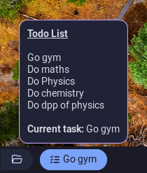
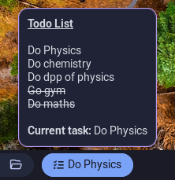
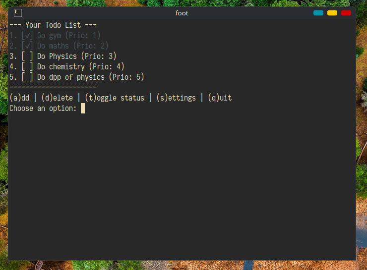
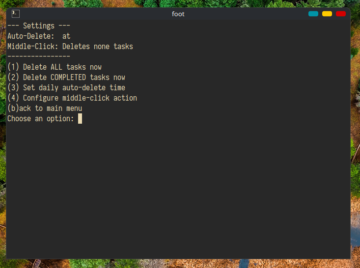

# Waybar Todo Lists 📝

A lightweight, customizable todo list manager integrated with Waybar. Manage your tasks directly from your system bar with a terminal-based UI and click-action support.

## Features ✨

- **Waybar Integration**: Display your current task directly in your Waybar status bar
- **Terminal UI**: Interactive terminal interface for managing tasks
- **Priority System**: Organize tasks by priority numbers
- **Task Status Tracking**: Mark tasks as pending or completed
- **Auto-Delete**: Automatically delete tasks on a scheduled time
- **Configurable Actions**: Customize middle-click behavior
- **Real-time Updates**: Instant feedback in the Waybar module
- **Tooltip Display**: View all tasks in the Waybar tooltip
- **Conflict Resolution**: Smart priority handling when adding tasks

## Preview 

### Waybar Display




### Terminal UI



## Installation 

1. Clone the repository:
```bash
git clone https://github.com/Harsh-bin/waybar-todo-lists.git
cd waybar-todo-lists
```

2. Copy the scripts to your Waybar config directory:
```bash
mkdir -p ~/.config/waybar/scripts/todo
cp todo.sh todo_tui.sh ~/.config/waybar/scripts/todo/
chmod +x ~/.config/waybar/scripts/todo/*.sh
```

> [!CAUTION]
> The bash script is configured to use `$HOME/.config/waybar/scripts/todo` (as the TODO_DIR variable). So, you can use the suggested installation step or modify it as needed. <br></br>
> The script uses Foot as default terminal. If you need to change this modify this line in `todo.sh`

```
    open_tui)
        foot -e "$TUI_SCRIPT" # change this to your preferred terminal
        exit 0
        ;;
```
3. Add the module to your Waybar configuration: 
```jsonc
{
      "custom/todo":
      {
          "format": "\u00a0{}",
          "exec": "~/.config/waybar/scripts/todo/todo.sh",
          "on-double-click": "~/.config/waybar/scripts/todo/todo.sh mark_done",
          "on-click-right": "~/.config/waybar/scripts/todo/todo.sh open_tui",
          "on-click-middle": "~/.config/waybar/scripts/todo/todo.sh middle_click",
          "return-type": "json",
          "interval": 5,
          "tooltip": true
      },
}
```

## Usage if you use my `configuration`.

- **Right Click**: Open the interactive TUI
- **Middle Click**: Delete all task or Delete all completed task (configurable)
- **Double Click**: Mark task complete

#### Available Commands:
- **(a)dd**: Add a new task with priority
- **(d)elete**: Remove a task by number
- **(t)oggle**: Mark a task as complete/pending
- **(s)ettings**: Configure auto-delete and click actions etc...
- **(q)uit**: Exit the application

#### Settings Menu:
- **Delete ALL tasks now**: Permanently remove all tasks
- **Delete COMPLETED tasks now**: Remove only completed tasks
- **Set daily auto-delete time**: Configure automatic deletion at a specific time
- **Configure middle-click action**: Set what happens on middle-click

## Functions 🔧

**`middle_click` (action)**
- Executes the configured middle-click action
- Can delete completed tasks or all tasks based on configuration
- Triggered by middle-clicking the Waybar module `if used my config`

**`Auto-Delete Logic`**
- Checks if a scheduled deletion time has passed
- Automatically deletes tasks at the configured time (once per day)
- Updates `LAST_CHECKED_TIMESTAMP` to prevent duplicate deletions
- Supports deleting either completed tasks or all tasks
- **Can disable auto-delete by typing $${\color{red}disable}$$**


**`sort_tasks()`**
- Sorts all tasks by priority number (ascending order)
- Runs automatically after each task modification
- Ensures tasks are always displayed in priority order

#### Task Management Functions

**`add_task()`**
- Prompts user for task description and priority number
- Validates input (description non-empty, priority is numeric)
- Handles priority conflicts intelligently:
  - If priority already exists, asks if new task should be higher priority
  - Auto-adjusts conflicting priorities accordingly
- Automatically sorts tasks after addition


#### Settings Functions

**`delete_all_tasks_now()`**
- Deletes all tasks irreversibly


**`delete_completed_tasks_now()`**
- Removes only completed tasks (those with status = 1)

**`set_auto_delete()`**
- Allows user to set a daily deletion time
- Accepts flexible time formats (e.g., "14:10", "2:10pm")
- Lets user choose to delete completed tasks or all tasks
- **Can disable auto-delete by typing $${\color{red}disable}$$**

**`set_middle_click()`**
- Configures what happens when middle-clicking the Waybar module
- Options:
  - (1) Delete completed tasks
  - (2) Delete all tasks

## Author ✍️

Created by [Harsh-bin](https://github.com/Harsh-bin)

---

**Enjoy your todo list! 🎉**
